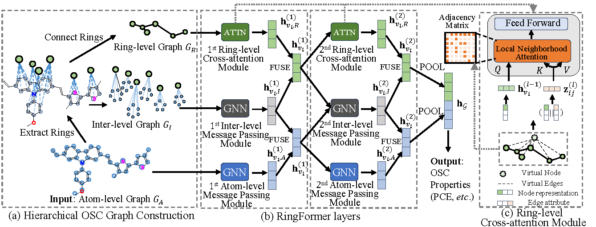

# RingFormer: A Ring-Enhanced Graph Transformer for Organic Solar Cell Property Prediction

This repository is a reproduced MindSpore implementation of RingFormer in "RingFormer: A Ring-Enhanced Graph Transformer for Organic Solar Cell Property Prediction". 



## Requirements

To install requirements:

```setup
pip install -r requirements.txt
```

## Datasets

| DATASET   | #GRAPHS | AVG. # NODES | AVG. # EDGES | AVG. # RINGS |
| --------- | ------- | ------------ | ------------ | ------------ |
| CEPDB     | 2.2M    | 27.6         | 33.3         | 6.7          |
| HOPV      | 350     | 42.7         | 49.3         | 7.5          |
| PFD | 1055    | 77.1         | 84.2         | 8.2          |
| NFA       | 654     | 118.2        | 133.0        | 15.8         |
| PD      | 277     | 80.7         | 88.2         | 8.5          |

# Results

PCE (%) prediction performance: 

| Experiments   | HOPV | PFD |
| ------------ | --------- | --------- |
| Original Paper | 1.477±0.021 | 1.776±0.014 |
| Reproduced | 1.5775±0.0707  | 1.7781±0.0725 |


## Training & Evaluation
* To construct ring graphs, run this command:
```train
python generate_ring_graphs.py --dataset <dataset> 
```

* To train the model(s) in the paper, enter ringformer_mindspore.ipynb:
```train
import sys
sys.argv = [
    "train.py",          
    "-dataset","<dataset>",
]

args = parser.parse_args()                
train(args, None) 
```
--dataset: ('HOPV', 'PFD', 'NFA', 'PD', 'CEPDB')

